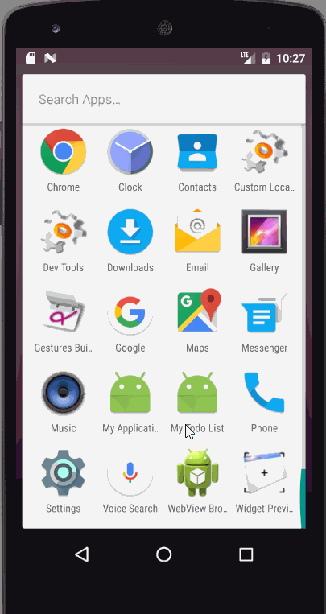

# ToDo Application Demo

This is an Android Todo application 

Time spent: 7 hours spent in total

Completed user stories:

 * [x] Required: User can view a list Todo
 * [x] Required: User can add a new Todo
 * [x] Required: User can edit a new Todo
 * [x] Required: Persist todo items and retrieve them properly on app restart

 * [x] Required: Using Sqlite
 * [x] Required: Using fragment
 * [x] Required: Using custom adapter
 * [x] Required: Adding some color, show latest todo first

Note:
 I spent alot of time on this project because its been a long time not working with android, I believe that I can make it better next time.

Walkthrough:

GIF created with [LiceCap](http://www.cockos.com/licecap/).